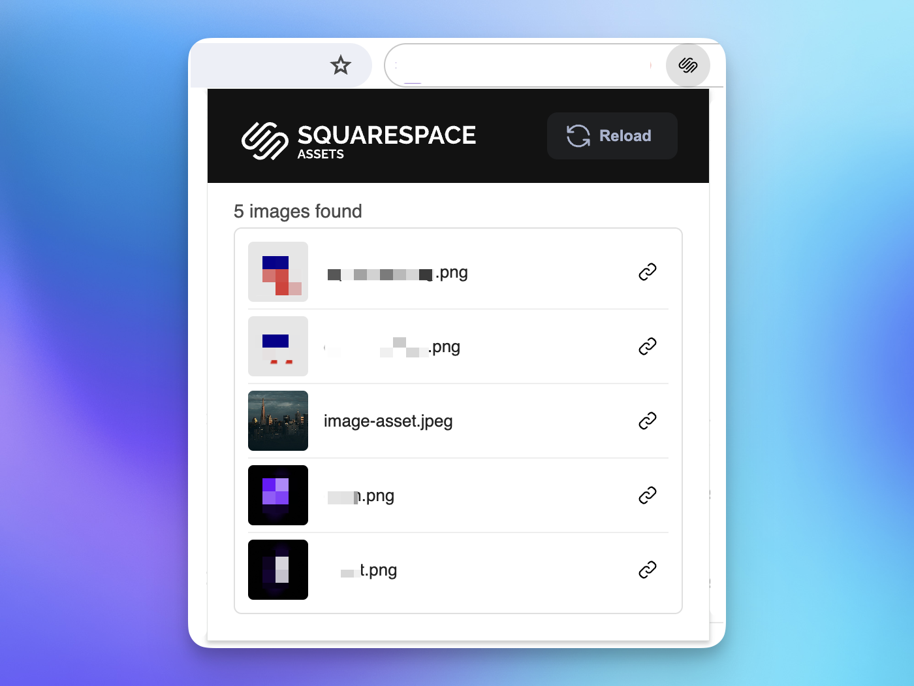

<h1 align="center">Squarespace Assets</h1>

This Chrome extension simplifies the process of copying asset URLs from the Squarespace assets library. It provides a convenient way to extract URLs for image files directly from your Squarespace account.
  

## Installation
To install the extension, follow these steps:

1. **Download the Extension:** https://chrome.google.com/webstore/detail/squarespace-assets/maiahpdbookhhbdnpcphbhmanbnndlgn

## How to Use
Using the extension is straightforward:

1. **Open Squarespace Assets Library:** Navigate to your Squarespace account and access the Assets section.
2. **Activate the Extension:** Click on the extension icon in the Chrome toolbar to activate it.
3. **Extract Asset URLs:** The extension will automatically list available images to copy. You can click the copy icon to copy your desired image.
4. **Paste Where Needed:** Paste the copied URL wherever you need it, such as in an image or video embed field on your Squarespace site.

Enjoy the convenience of quickly accessing and copying asset URLs from your Squarespace account with this handy Chrome extension!
